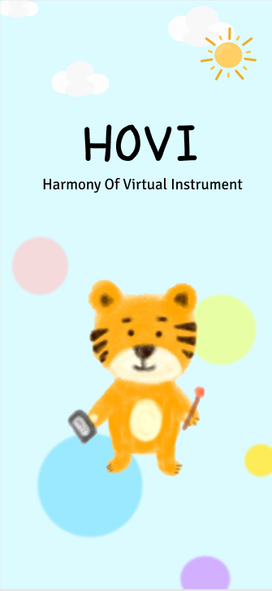
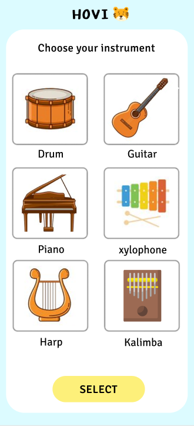
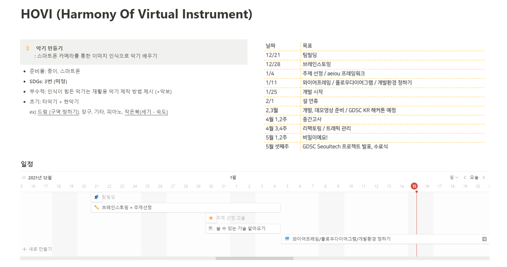
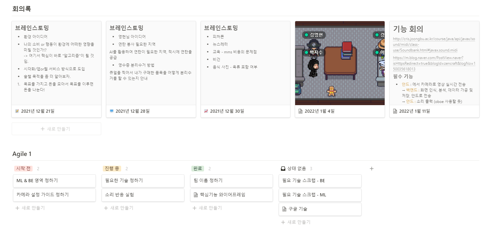

# 팀 멤버

-   박지수(back-end)
-   강인영(android)
-   이슬비(ML)
-   김영현(back-end)

# 1월 11일 기능 회의 🎻

## 필수 기능

#### Android (Front)
 1. 카메라로 영상 촬영, 실시간 서버로 전송
 2. 소리 출력 (oboe 사용 예상 중)

#### Server (Back)
 1. 화면 인식 데이터 ML 모델에 전송
 2. 분석 결과로 음성 출력에 사용할 데이터 안드에 전송

#### ML : 
 1. 사용자가 사용하려는 물건을 악기 인식
 2. 영상 데이터, 관절 움직임 분석으로 악기 작동 인식

 ---

## 부가 기능 😎

#### 녹음 기능 
- 모델을 통해 인식된 연주 데이터 저장
- 추후 연주 데이터만으로 음성 제공
#### 녹음된 연주 공유하기, 랭킹 시스템 도입
- 연주를 녹음할 때 악보로 만들어 주기
- 악보와 녹음 영상으로 학습 가능
#### 커뮤니티
- 연주 방법 공유
- 더 좋은 인식, 악기와 유사하게 만드는 노하우 공유
#### 녹음한 사운드를 함께 선택하여 하모니 출력
- 루프 스테이션과 비슷한 기능
#### 리듬 게임
- 악보를 통해 연주 정확도 점수 제공

---

## UI

### 우리 갓인영의 작품

디자이너는 없지만 내가 다 한다. -> 갓인영의 작품

|로딩|악기 선택|
|:-----:|:-----:|
|||

 

---
 

## 결정된 사항 🤔

1. 인식 관련 머신러닝은 back-end에서 돌려주기
2. 소리 출력 라이브러리는 안드에서 (oboe!)

 

## 다음까지 해올 것

- 영현 : 인식 모델 돌리는 방법 찾기!!
- 지수 : 화면 실시간 전송 방법 찾기!!
- 인영 : oboe 파헤치기!!
- 슬비 : 인식 관련 모델 찾아서 해보기!!

---
 

## ps. 갓슬비의 노션 사용법

### 노션은 이렇게 써야지!

#### 팀 설명, 일정

#### 회의록, Agile
