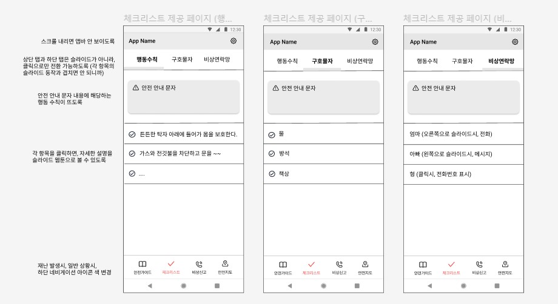
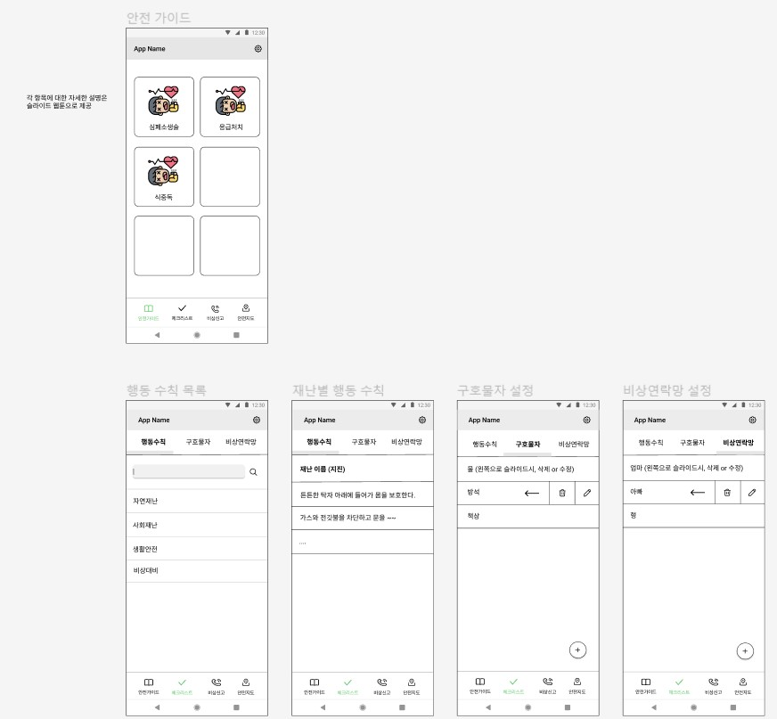
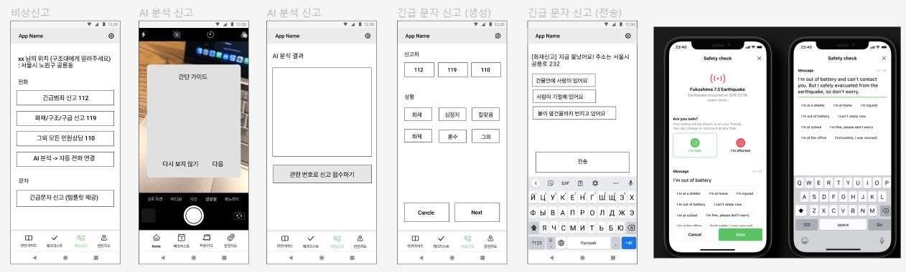

### 팀 구성
 백엔드 1명 + DL 1명 + 안드로이드 2명
+ 백엔드 : 이유석
+ DL : 황재영
+ 안드로이드 : 이하은, 백송희
  

### 주제
재난에 효율적으로 대처할 수 있는 서비스 제공
1. 재난 상황 행동 수칙 제공
2. 근처 대피소, 병원 등등 위치 제공
3. 사용자가 직접 만드는 비상 연락망 & 구호물자

등을 제공하는 앱을 만들고자 합니다!
  

### 팀 이름 소개
팀 이름 : **골든아워**

골든아워란?
'사고 발생 후 환자의 생사를 결정지을 수 있는 치료가 이루어져야하는 최소한의 시간'

여기서 아이디어를 얻어 빠르게 재난 상황을 헤쳐나갈 수 있게 가이드를 제공하겠다는 의미입니다!
  

### 와이어 프레임
어느 정도 주요 기능에 대한 회의를 한 다음 대략적인 와이어 프레임을 만들었습니다.
와이어 프레임 제작 과정에서 기획 수정이 있었지만, 어느 정도 큰 틀은 완성 했습니다!

