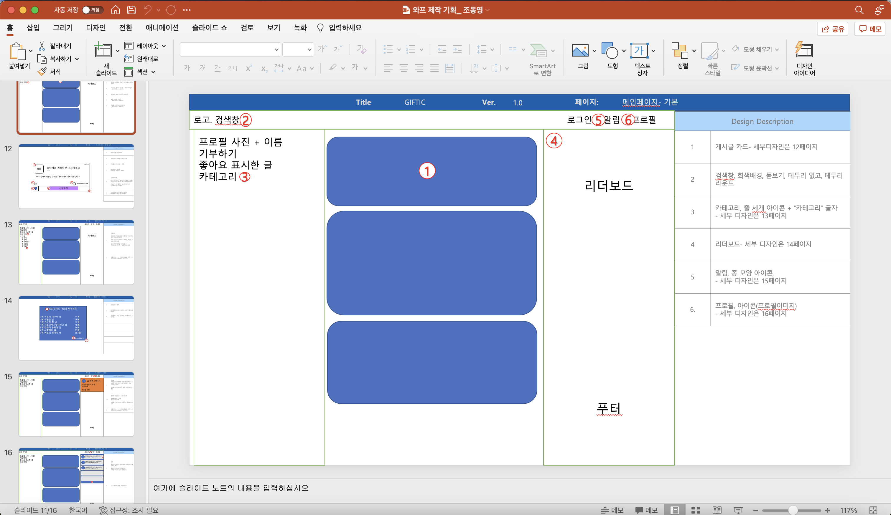

### GIFTIC 두번째 이야기

#  1. 주제 변경

## 기존의 아동용 도서 기부 플랫폼(체리북) 에서 기프티콘 나눔 커뮤니티(GIFTIC)으로 변경 

 - 대상과 재화가 너무 한정적이라 판단했음
 - 조금더 유동적이고 전달, 사용, 수급이 편한 재화를 고민
 - 가상 재화인 기프티콘으로 변경
 - 기존의 도서 기부 플랫폼을 구현했을 때의 기술적 한계

> 기부자와 소외계층간 손쉬운 기부, 손쉬운 사용을 할 수 있는 '기프티콘' 으로 재화 선정

# 2. 유저플로우 확립

 - 기부자: 기부자는 본인이 사용하지 않는 기프티콘을 웹에 등록 하여 기부를 실천한다.
 - 신청자: 신청자는 최대 7명이고,  기부자가 올린 글에 신청을 할 수 있다.
 - 기부자 - 신청자: 7명의 신청자 중 랜덤으로 당첨자 한명을 선정한다.
 - 당첨자: 당첨자는 당첨된 기프티콘을 받는다.

## 기대

 1. 기부에 대한 진입장벽 완화
 2. 사용하지않거나, 유효기간이 다다른 기프티콘 소비 촉구
 3. 소액기부 활성화
 4. 취약계층 지원

# 3. 기능 기획

 - 좋아요 표시를 통한 관심게시글 설정 + 필터링
 - 기부자들에게 부여되는 등급제도
 - 상위 등급 유저들에게 제공되는 리더보드
 - 기부글 작성과 기프티콘 제공까지 한번에 진행되는 설계

## 기능 명세서 작성

## 사용 SW 선정

 - 디자인: figma
 - 서버: Node.js, AWS, Mysql
 - 로그인: Google OAuth
 - 웹: Javascript, React, Typescript, Lottie.js

# 4. 디자인 기획

 - 랜딩페이지: 서비스 소개, 서비스 설명, 목적 기대치 소개
 - 유저 커뮤니티: 게시글 등록, 기부 신청, 알림 등 하나의 페이지에 구현
 - 프로필 페이지: 프로필 정보, 당첨 목록, 작성 게시글 목록등

## 와이어 프레임워크 제작
디자인관련 외부 디자이너 의뢰, 이에 디자인 기획서 제작해서 전송

