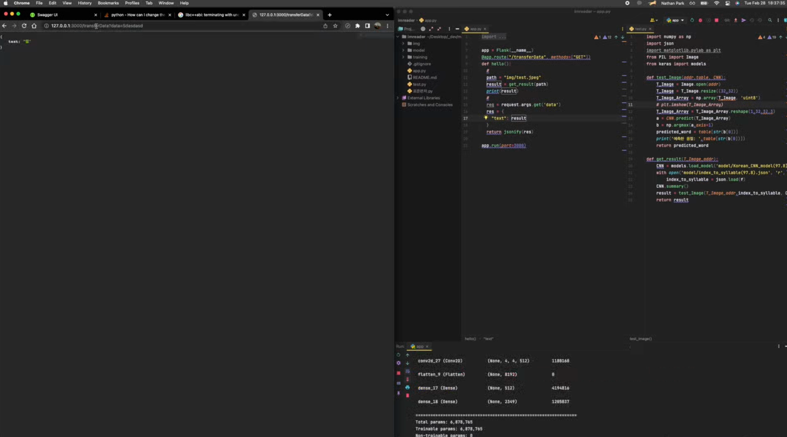
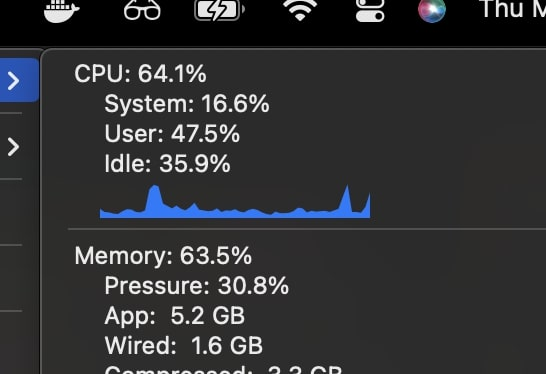
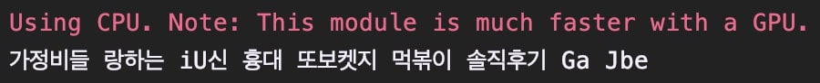

Hello Everyone~ 모두들 오늘 하루도 잘 지내셨나요?
전 잘 지냈습니다!
저를 소개하자면 helppy의 백엔드를 담당하고 있는 박인재입니다! 
팀블로그는 처음이라 너무 떨리네요! 그럼 보실까요?

---
 

# 10주차(3/2)

오늘은 저희 처음으로 4인조로 결합 한 날이에요! 
확실히 다 같이 만나니까 개발 속도도 빨라지고 아이디어도 많이 나온 것 같아요.
그동안 어떻게 스프링으로 ML팀의 모델을 연결할지가 큰 고민중 하나였는데, 프론트엔드에서 보낼 데이터가 많지 않아
굳이 스프링을 쓸 필요가 없다고 생각했어요!

그래서 스프링 대신 쓰려고 한 프레임 워크는 바로 Flask! 재영님이 보내주신 이미지 데이터를 Flask API로 받아서 바로 
파이썬으로 만든 모델에 넣고, 이후 출력결과를 프론트에 쉽게 넘겨줄 수 있겠다 생각했어요.

하지만 저만 잘 됐다고 끝난게 아니죠!
준석님과 슬비님이 성능이 좋은 모델을 개발하고, 찾는데에 고생을 많이 했답니다.
또한 재영님도 클라이언트에서 서버로 넘겨줄 이미지를 Byte Array로 어떻게 변환하고, 
화면의 컴포넌트에 어떻게 접근할 지 많이 고만하는 시간을 가졌습니다!

그 결과, 슬비님이 테스트용으로 주신 OCR코드를 Flask API와 연결하여 입력에 대한 출력물을 
reponse로 보내는 것을 성공했어요!

짜잔~ 별거 아닌 것 같지만 저희는 이후 개발될 AI모델을 클라이언트에 잘 돌려줄 수 있는 희망을 가질 수 있었어요!
그렇게 우리는 우리 팀끼리 회식을 하며 즐거운 10주차를 마무리 했습니다!

 

# 11주차 (3/6 + 3/9)

 

오늘은 EasyOcr모델을 사용해서 Flask API와 연동해 보았어요!
가지고 있는 이미지를 Byte Array로 변환하고, 이를 Byte String으로 다시 변환하여 Easy Ocr모델에
주입하여 보았습니다. 처음엔 제가 Byte Array와 Byte String의 차이를 잘 알지 못하여 모델 돌리는 것 부터
어려움을 겪었는데요.. 하지만 이젠 괜찮습니다! 이제 재영님이 클라이언트의 이미지를 Byte Array로 넘겨줄 일만 남았어요~

 

하지만 문제가 하나 발생했는데... Byte String를 EasyOcr에 인자로 넣고 실행시켰을 때 GPU가 없어 CPU를 많이 소모 
하더군요.. 이는 서버 한대로 감당하기가 어렵다고 생각해 EasyOcr을 구글 코랩과 연동시켜보면 어떨까? 라고 생각하게 되었습니다. 
저의 Flask에서는 클라이언트의 요청을 받고, 구글 코랩 모델로 요청값을 보내고, 다시 받고, 클라이언트에 보내주기만 하면 되는거죠!

## Easy OCR 모델링 결과

- 소스 사진

- 출력 결과

 

개강하니 다들 바쁘시죠??
그래도 우리 끝까지 열심히 마무리 지었으면 합니다!!
Helppy 화이팅!! 😇😇

 

