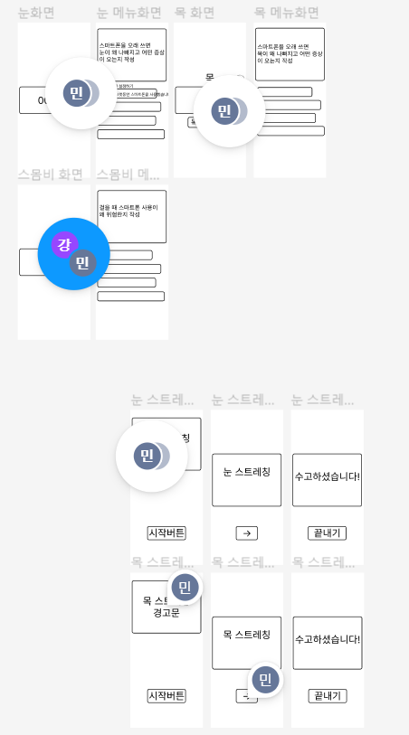

## stoPhone의 팀 구성

 - 강승구(android)
 - 박정준(DL)
 - 이민섭(android)

## stoPhone의 Ground Rule
 - 정규 회의 
  - 월요일 - 8 : 00 ~ 9 : 00 
  - 목요일 - 7 : 30 ~ 8 : 30
  - 회의 방법 - gather를 통한 회의
 - 협업 툴 - 노션

## 주제 선정
현대를 살아가는 사람들이라면 늘 스마트폰을 끼고 삽니다.
유튜브, 카카오톡, 페이스북, 인스타그램 등등 수많은 앱을 장기간 이용하면서 눈이나 목에 부담을 받습니다.
심지어 스마트폰을 걸어다니면서, 또는 어두운 장소에서 사용해 위험하거나 눈이 더욱 나빠지기도 합니다.
이러한 문제를 해결하기 위해, 저희 팀은 "스마트폰의 건강한 사용"을 주제로 삼았습니다.

사실 이 주제를 선정하기 전에, 한번 주제가 바뀌는 우여곡절을 겪었습니다.
이전 주제는 사람들이 영양소를 골고루 섭취하는 것을 돕기 위한 앱이었습니다.
사람들이 하루동안 먹은 음식을 앱에 기록해 그 사람의 식생활평가지수와 부족한 영양소를 채워줄 음식을 추천하는 기능을 구현하려고 했습니다.
그러나, 조사 과정에서 식생활 평가지수에 대한 정보가 부족하고 음식의 영양소에 관한 데이터베이스 구축이 어렵다고 생각해 주제를 바꾸게 되었습니다.

## 주제 구체화
stoPhone은 특정 상황, 특정 시간때에 사용자에게 알림을 보내 폰 사용을 막거나, 폰으로 부담이 간 신체의 스트레칭을 하도록 만듭니다.
또한, 폰을 사용하면서 눈이 가장 부담이 크다고 생각했기에 사용자가 설정해놓은 일정 시간이 지나면 짧은 시간동안 눈 스트레칭을 하도록 만듭니다.
자세한 구성은 아래와 같습니다

- 눈
 - 일정 시간 이상 사용시 눈 스트레칭을 하게 한다.(ex - 사용자가 30분으로 설정했다면 30분 사용후 눈 스트레칭이 끝내면 다시 폰을 사용할 수 있다.)
 - 어두운 장소에서 사용할 경우엔 설정한 시간보다 더 짧은 간격으로 눈 스트레칭 하게 한다.
- 목
 - 사용자가 설정한 시간대가 되면 알람을 보내 사용자가 목 스트레칭을 하게 한다.
- 스몸비(걷는 중에 스마트폰 사용)
 - 사용자가 걷는 도중에 스마트폰을 사용한다면 짧은 간격으로 사용자에게 스마트폰을 사용하지 말라는 알람을 보낸다. 

## 앱 이름
앱 이름의 후보로는..
 - my healthy phone
 - phone stop
 - stoPhone
 - digital detox(를 변형한 앱 이름)
이 있었으나 "stop"과 "Phone"의 "P"가 겹친다는 것을 이용한 stoPhone이 이름 후보중에 제일 나은 것 같아 stoPhone이 앱 이름이 되었습니다.

## 현재 진행 상황

놀랍게도 와이어 프레임입니다.

지금 저희 팀은 와이어프레임(?)을 만들었고 그에 따라 UI를 만들고 있습니다. 
 - 메인화면 - 박정준
 - 메뉴화면 - 강승구
 - 스트레칭화면 - 이민섭
와이어 프레임을 좀 추상적으로 만들어서 일부 파트에 구체적으로 무엇을 넣어야 할지 구상 중입니다.
전체적인 앱 색상은 눈이 편하다는 초록색으로 설정했고 폰트는 나눔 스퀘어 라운드를 사용하기로 했습니다.

아직 코틀린에 능숙치 못해서 이번 프로젝트동안 열심히 해야할 것 같습니다...
